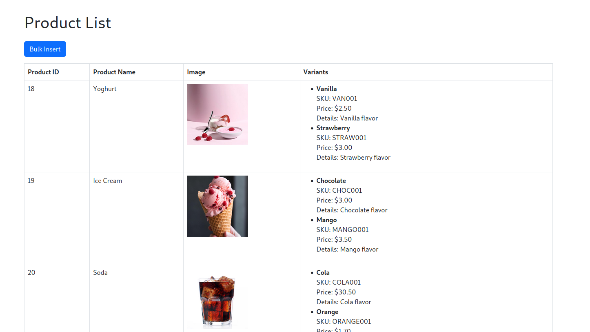
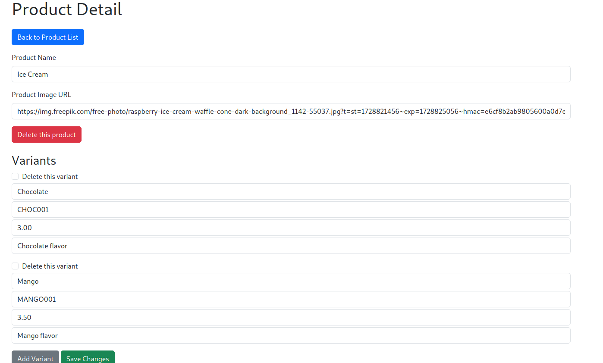
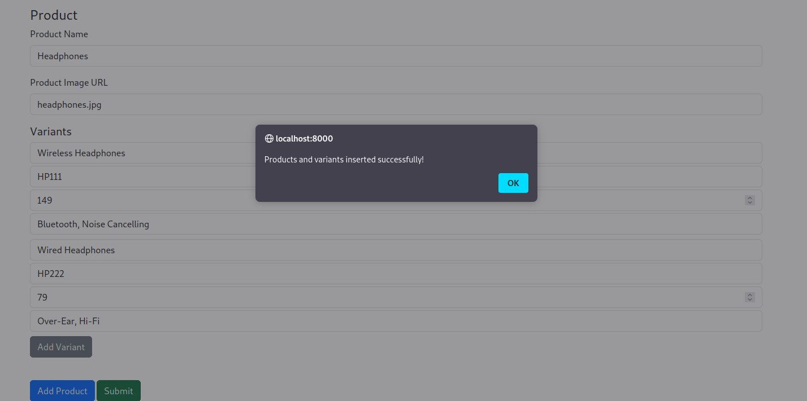
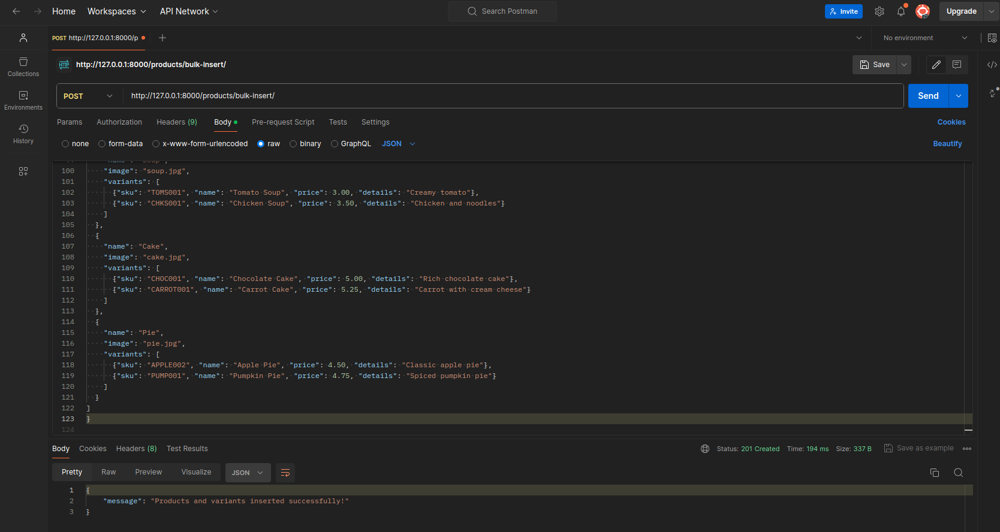

# Django Bulk Insert API for Products and Variants

This project implements a Django API that supports bulk insertion of products and their variants, along with full CRUD functionality. The application has been deployed and is accessible for demonstration purposes at the following link:

[**Live Demo**](#)

## Features

- **Bulk Insert**: Efficiently bulk insert products and their variants using a single API endpoint.
- **CRUD Functionality**: 
  - **Create**: Add products and their variants via the bulk insert API.
  - **Read**: 
    - List all products and their variants.
    - View individual product details.
  - **Update**: Modify existing product and variant details.
  - **Delete**: Remove products and their variants.
- **Optimized Queries**: Prefetch related product variants for efficient data retrieval in the list view.
- **Data Integrity**: Bulk insert operations are wrapped in a transaction to ensure atomicity.
- **Error Handling**: Implements robust exception handling and returns appropriate HTTP responses.
- **CSRF Exempt**: Allows POST requests without a CSRF token for bulk insertion.

## Screenshots

### Product List Page
_A screenshot showing the product list with all variants._


### Product Detail Page
_A screenshot showing the details of a single product along with its variants._


### Bulk Insert via API
_A screenshot showing a successful bulk insert request._


## API Endpoints

### Bulk Insert Products and Variants
- **URL**: `/products/bulk-insert/`
- **Method**: `POST`
- **Request Body Example**:
    ```json
    {
        "name": "Yoghurt",
        "image": "yoghurt.png",
        "variants": [
            {
                "sku": "VAN001",
                "name": "Vanilla Yoghurt",
                "price": "2.50",
                "details": "Vanilla flavor"
            },
            {
                "sku": "STR001",
                "name": "Strawberry Yoghurt",
                "price": "3.00",
                "details": "Strawberry flavor"
            }
        ]
    }
    ```
- **Response**:
    ```json
    {
        "message": "Products and variants inserted successfully!"
    }
    ```

### List Products and Variants
- **URL**: `/products/`
- **Method**: `GET`
- **Response**

### Product Detail
- **URL**: `/products/<id>/`
- **Method**: `GET`, `PUT`, `DELETE`
- **Response** 

## Installation

1. Clone the repository:
   ```bash
   git clone <repository-url>
   cd <repository-folder>
   ```

2. Install the dependencies:
   ```bash
   pip install -r requirements.txt
   ```

3. Apply migrations to set up the database:
   ```bash
   python manage.py migrate
   ```

4. Run the Django development server:
   ```bash
   python manage.py runserver
   ```

## Project Structure

```plaintext
config/
│   ├── __init__.py
│   ├── asgi.py
│   ├── settings.py
│   ├── urls.py
│   └── wsgi.py
env/
images/
│   ├── bulk_insert.png
│   ├── detail.png
│   ├── list.png
│   ├── post.png
products/
│   ├── migrations/
│   ├── __init__.py
│   ├── admin.py
│   ├── apps.py
│   ├── models.py
│   ├── tests.py
│   ├── urls.py
│   └── views.py
templates/
│   ├── product_detail.html
│   └── product_list.html
db.sqlite3
manage.py
requirements.txt
```

## Models

### `Product`
- `id`: Integer (Primary Key)
- `name`: String
- `image`: String

### `ProductVariant`
- `id`: Integer (Primary Key)
- `sku`: String
- `name`: String
- `price`: Decimal
- `details`: String
- `product_id`: ForeignKey to `Product`

## Usage Example

Using **Postman**, you can interact with the API endpoints to bulk insert, list, retrieve, update, or delete products and their variants. For example, to insert bulk products:

_A screenshot showing a successful bulk insert request in Postman._


## Optimization

- The `product_list` view uses `prefetch_related` to minimize database queries and efficiently retrieve related `ProductVariant` objects.

## Testing

Run the following command to execute unit tests:
```bash
python manage.py test
```

## Contributing

1. Fork the repository.
2. Create a feature branch (`git checkout -b feature-branch`).
3. Commit your changes (`git commit -am 'Add new feature'`).
4. Push to the branch (`git push origin feature-branch`).
5. Open a Pull Request.

---

This project was developed for technical assessment. It demonstrates an efficient way to bulk insert product data into a Django backend.
